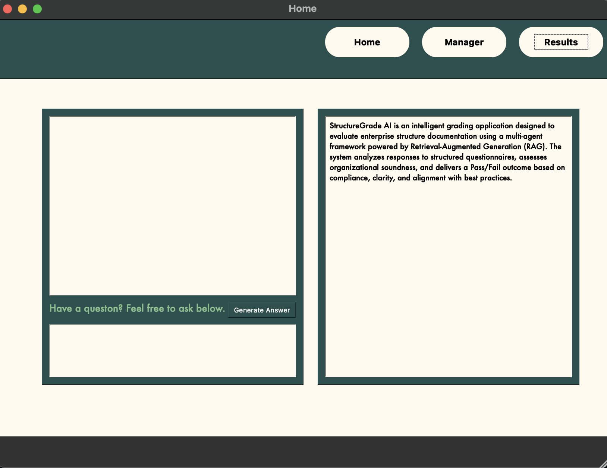
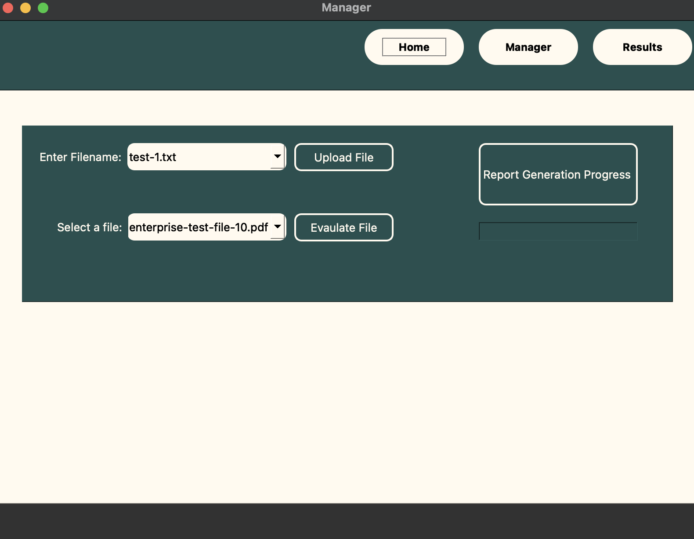
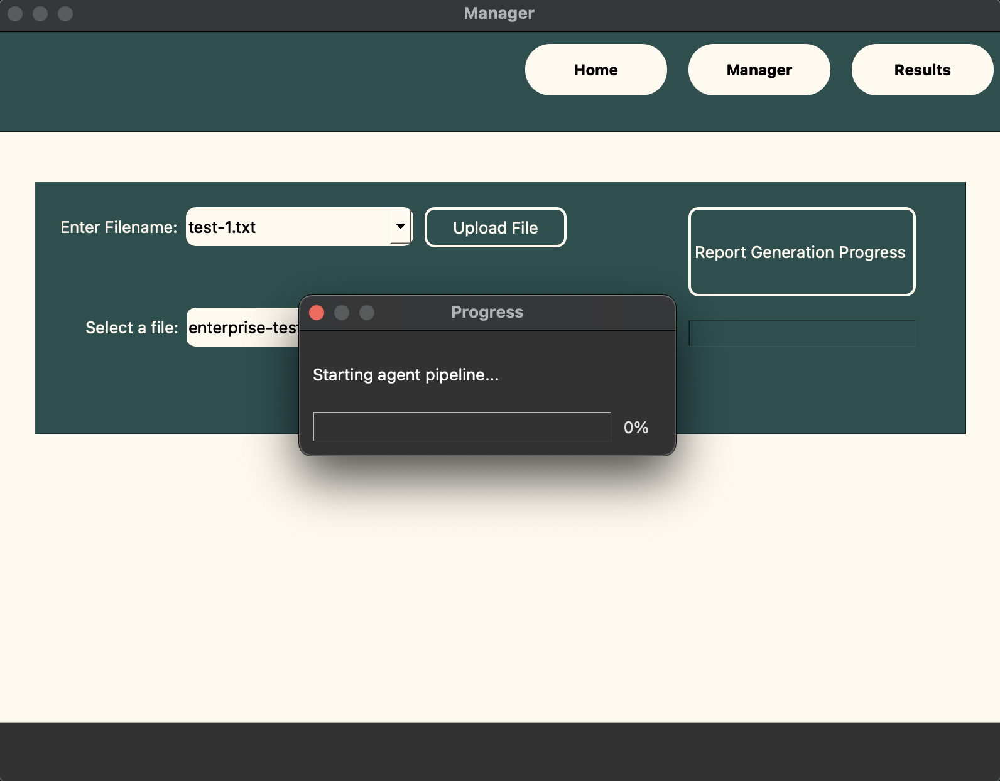
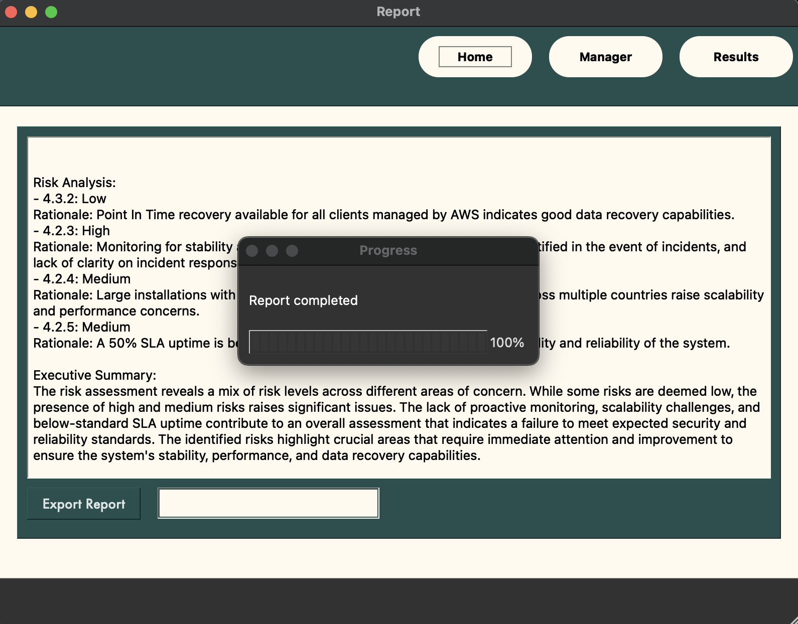
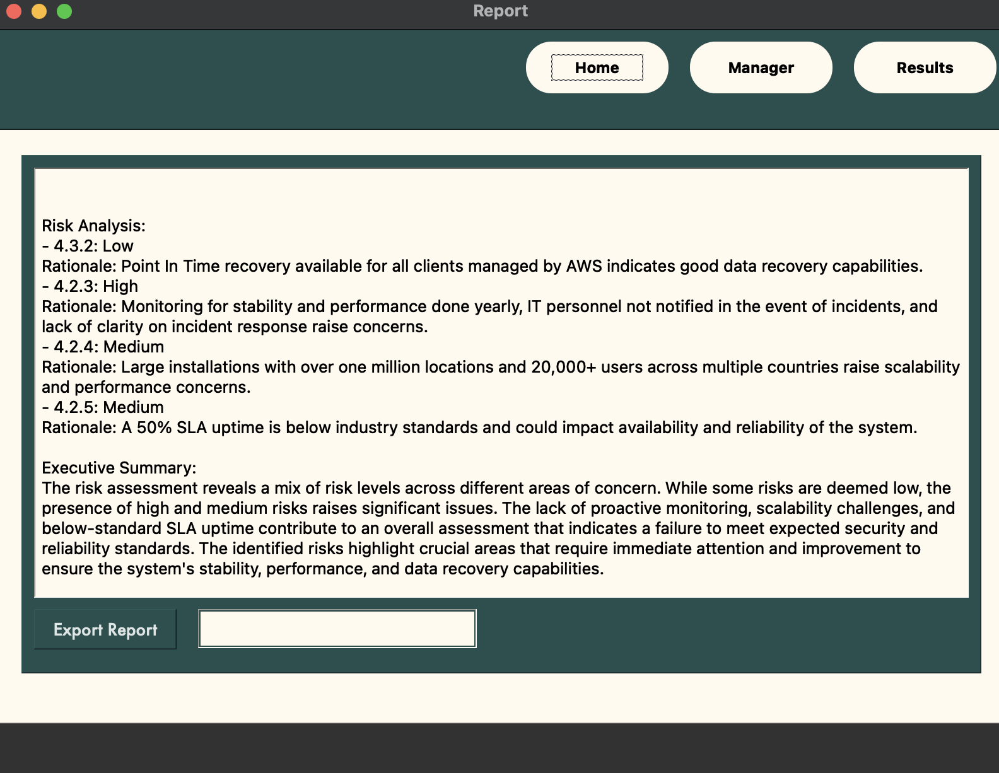

# 🛡️ AI Third-Party Risk Evaluator

StructureGrade AI is an intelligent multi-agent application designed to evaluate enterprise structure documentation using a Retrieval-Augmented Generation (RAG) framework. The system uses Azure OpenAI, Cognitive Search, and Blob Storage to process enterprise documentation and return structured, explainable risk assessments.

---

## 🚀 Features

- 🧠 **Multi-Agent Pipeline** – Modular agents for search, grading, reporting, and planning
- 🔍 **Semantic Retrieval** – Azure Cognitive Search + OpenAI RAG integration
- 📂 **File Upload + Evaluation** – GUI-based interface for selecting and processing files
- 📊 **Report Generation** – AI-generated executive summaries with rationale and compliance grading
- 🖥️ **PyQt6 UI** – Desktop GUI application with real-time progress tracking

---

## 🧠 Tech Stack

- `Python 3.11+`
- `Azure OpenAI (GPT-4)`
- `Azure Cognitive Search`
- `Azure Blob Storage`
- `PyQt6`
- `RAG Framework`

---

## 🖥️ UI Preview

### 🔹 Home Screen
Displays app description and GPT-powered input field.

---

### 🔹 File Manager View
Upload files, evaluate, and monitor agent pipeline status.

---

### 🔹 Progress Popup (0%)
Progress bar during evaluation.

---

### 🔹 Progress Popup (100%)
Progress bar post evaluation.

---

### 🔹 Report Output
Risk breakdown and executive summary generated by the system.

---

## 👤 Author
**Robert Patel** – [GitHub](https://github.com/robertpatel28) | [LinkedIn](https://www.linkedin.com/in/robertpatel)
